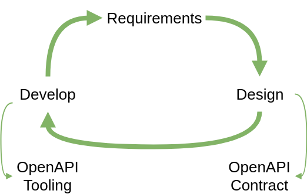
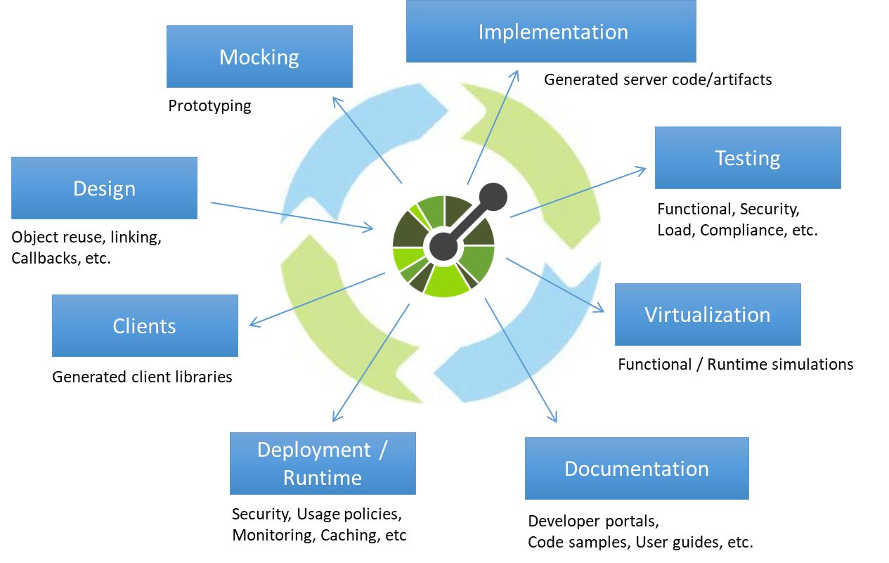
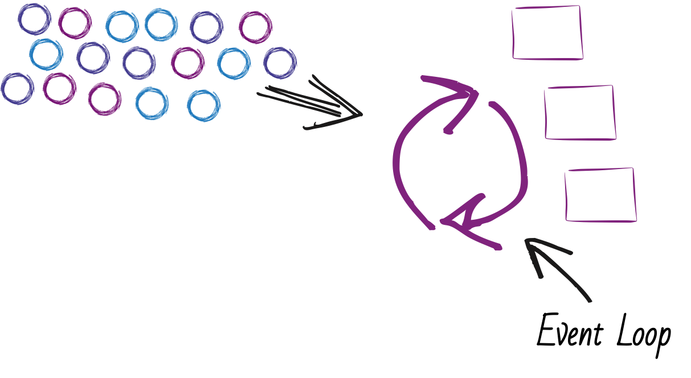

# Design Driven Web APIs with Vert.x

---

## About Me

Vert.x Mantainer - Credimi IT Engineer Intern - IT Engineering Student at Politecnico di Milano

*  @slinkyguardiani</img>
*  @slinkydeveloper</img>
*  slinkydeveloper.github.io</img>

</img>

---


Open standard for Web APIs

---

## Contract First Approach



<p class="fragment">You write code during design phase...</p>

---

#### ... And you use it during every API lifecycle phase!



---

### OpenAPI: joint venture of Swagger, RAML, API Blueprint and other old standards


Note:
Documentazione delle API:
OData Microsoft 2007 In Corso - WADL 2009 Sun - API Blueprint 2013 - Swagger 2010 - Raml 2013 Mulesoft e partner Adobe, Cisco, Google, PayPal - Tutti joinano in OpenAPI Initiative

---

## OpenAPI spec

<pre class="remaining-height"><code class="lang-yaml hljs" data-trim>
openapi: "3.0.0"
info:
  title: "Super Awesome API!"
  version: "1.0.0"
paths:
  /hello_world: ...
  /users: ...
  /products: ...
components:
  schemas:
    User: /* Json schema of user */
</code></pre>

---

## Path definition

<pre class="remaining-height"><code class="lang-yaml hljs" data-trim>
/ping: /* Path name */
  post: /* HTTP Method */
    operationId: ping /* Unique operation id */
    summary: Calculate the pong from the ping provided
    parameters: ... /* Request parameters */
    requestBody: ... /* Request body description */
    responses: ... /* Responses */
</code></pre>

---

## Parameters definition

<pre class="remaining-height"><code class="lang-yaml hljs" data-trim>
parameters:
  - name: latitude
    in: query
    description: Latitude component of location.
    required: true
    schema:
      type: number
      format: double
  - name: longitude
    in: query
    description: Longitude component of location.
    required: true
    schema:
      type: number
      format: double
</code></pre>

---

## Request body definition

<pre class="remaining-height"><code class="lang-yaml hljs" data-trim>
requestBody:
  required: true
  content:
    "application/json":
      schema: /* We reefer to schema inside components */
        $ref: '#/components/schemas/Ping'
    "application/x-www-form-urlencoded":
      schema:
        $ref: '#/components/schemas/Ping'
</code></pre>

Note:
La cosa interessante è che possiamo definire in OpenAPI anche differenti metodi di serializzazione del request body

---

## Responses definition

<pre class="remaining-height"><code class="lang-yaml hljs" data-trim>
responses:
  200: /* HTTP Status code 200 */
    description: All Good, returning Pong
    content:
      application/json:
        schema:
          $ref: '#/components/schemas/Pong'
  400:
    description: Wrong Ping!
</code></pre>

---

## And now we develop!

---

_The most important requirement of your public/private Web API is the **high throughput**_

---

## C10K Problem

Note:
Il problema C10K (Dan Kegel 1999) consiste nell'avere 10.000 connessioni contemporaneamente sullo stesso web server. Anche se interfaccia li gestisce sposto comunque il collo di bottiglia in un altro punto (esempio accesso a DB).

---


* Reactive
* Lightweight
* Polyglot
* General purpose
* All in one toolkit
* No application servers, only Java SE!

Note:
Eclipse Vert.x è un progetto della Eclipse Foundation
- network utility, applicazione web moderna, microservice, processing di eventi, monolita con event bus
- java, javascript, groovy, ruby, ceylon, scala e kotlin

---

## Reactive: Async, Non blocking, Message Driven

---

## All in one Toolkit

* Event Bus - JSON - FS - Logging - HTTP - TCP - UDP
* Web - Web Client - API Contracts
* MongoDB - JDBC - SQL - Redis - Reactive PostgreSQL
* JWT - OAuth 2 - Shiro
* SMTP - Kafka - RabbitMQ - AMQP
* `reactiverse` & `vertx-awesome`

---

## How Vert.x works?

---

### The (Multi) Reactor Pattern

---

## Handlers (or callbacks)

```java
(messageContext) -> {
  // Do some stuff with message payload
  // Reply with methods included inside context
}
```

---

## Event Loop and Handlers


Note:
Gli Handler sono frammenti di codice implementati da voi che eseguono azioni in risposta a determinati eventi

L'Event Loop è un thread che attende il verificarsi di un evento e una volta verificato richiama l'Handler

L'handler viene eseguito sull'event loop!

---

## Never stop the event loop!


Note:
La regola fondamentale è: mai bloccare l'event loop, cioè non eseguire mai codice bloccante all'interno degli handler!

---

</img>

---


Note:
Un handler, una volta gestito l'evento, può richiedere una nuova operazione asincrona che genererà un nuovo evento (richiesta a un DB)

Gli eventi come la richiesta a un DB vengono eseguiti:
* da worker thread, thread isolati che fanno il "lavoro pesante" e vengono spawnati automaticamente quando è possibile
* vengono gestiti dalle interfacce native asincrone

---

</img>

---



Note:
Anche se può sembrare contro intuitivo, la gestione di moltissimi eventi è efficiente con il pattern reactor.

---


Note:
La maggiore differenza tra NodeJS e Vert.x è il pattern multi reactor, cioè abbiamo diversi event loop. Questo è possibile perchè gli Handler sono indipendenti tra loro.

---

## C10K with Multi-Threading

</img>

---

## C10K with NodeJS

</img>

---

## C10K with Vert.x

</img>

---

## Event Bus

Note:
Vert.x per rinforzare l'idea di Message-driven predisponde un event bus, cioè un sistema di messagistica M2M che predispone 3 tipi di comunicazione

---

#### Point 2 Point


---

#### Publish-Subscribe


---

#### Request Response (RPC)


---

#### Scaling and Connectivity

</img>

Note:
L'event bus ha dei client non solo per Vert.x stesso, ma per qualsiasi linguaggio/framework, di conseguenza posso collegare la mia applicazione Vert.x a un'applicazione Node, C++, Python, ecc...

---

# Vert.x Web

An express/connect style web framework that helps you to create RESTful HTTP web applications

Note:
Ora passiamo a vert.x web, il framework built-in di vert.x che semplifica la creazione di applicazioni web

---

## Features

* <p class="fragment">Routing</p>
* <p class="fragment">Parameters extraction</p>
* <p class="fragment">Authorization with JWT</p>
* <p class="fragment">Server side rendering</p>
* <p class="fragment">Automatic Request body parsing</p>
* <p class="fragment">There are too much features!</p>

---

## Routing

```java
// Instantiate the Router
Router router = Router.router(vertx);
router.route("/hello").handler(routingContext -> {
  HttpServerResponse response = routingContext.response();
  // Get the query param (example req: /hello?name=francesco)
  String name = routingContext.queryParam("name");
  // Write to the response and end it
  response.end("Hello World " + name);
});

vertx.createHttpServer() // Create HTTP Server
    .requestHandler(router::accept).listen(8080);
```

Note:
Far notare:
- Router e metodi
- RoutingContext (contiene request, response)

---


Note:
Il Router di Vert.x è questo felicissimo postino

---

## Parameters

```java
router
  .route(HttpMethod.GET, "/university/:nation/:name")
  .handler(routingContext -> {
      // For example if we request:
      // "/university/italy/polimi?course=it_engineering"
      String nation = routingContext.pathParam("nation");
        // = italy
      String name = routingContext.pathParam("name");
        // = polimi
      String course = routingContext.queryParam("course");
        // = it_engineering
      // Elaborate the request!
});
```

Note:
- path parameters
- query parameters

---

## Json Bodies

```java
router.route().handler(BodyHandler.create());

router
  .route(HttpMethod.POST, "/user")
  .handler(routingContext -> {
      JsonObject body = routingContext.getBodyAsJson()
      // Elaborate the request!
});
```

Note:
Aggiungo BodyHandler che si occupa di parsare il body. A seconda del Content-Type parsa

---

## Vert.x ❤ OpenAPI

---

## vertx-web-api-contract

* <p class="fragment">OpenAPI 3 compliant API specification validation with automatic loading of external Json schemas</p>
* <p class="fragment">Automatic request validation</p>
* <p class="fragment">Router factory</p>

---

### OpenAPI3RouterFactory

* Async loading of specification and its schema dependencies
* Mount path with operationId or with combination of path and HTTP method
* Automatic request parameters validation
* Automatic convert OpenAPI style paths to Vert.x style paths
* Lazy methods: operations (combination of paths and HTTP methods) are mounted in declaration order inside specification
* Automatic mount of security validation handlers

---

### Initialize the Router Factory

<pre class="remaining-height"><code class="lang-java hljs" data-trim>
OpenAPI3RouterFactory.create(
  vertx, "petstore.yaml", ar -> {
    if (ar.succeeded()) {
      // Spec loaded with success
      OpenAPI3RouterFactory routerFactory = ar.result();
    } else {
      // Something went wrong
      Throwable exception = ar.cause();
    }
});
</code></pre>

---

### Add handlers to your operations

<pre class="remaining-height"><code class="lang-java hljs" data-trim>
routerFactory.addHandlerByOperationId(
  "awesomeOperation",
  routingContext -> {
    RequestParameters params =
      routingContext.get("parsedParameters");
    RequestParameter body = params.body();
    JsonObject jsonBody = body.getJsonObject();
    // Do something with body
});
</code></pre>

Note:
Spiegare il RequestParameters e RequestParameter

---

### Manage a failure

<pre class="remaining-height"><code class="lang-java hljs" data-trim>
routerFactory.addFailureHandlerByOperationId(
  "awesomeOperation",
  routingContext -> {
    Throwable failure = routingContext.failure();
    if (failure instanceof ValidationException) {
      // Something went wrong during validation!
      String validationErrorMessage = failure.getMessage();
    }
    // Handle your failure
});
</code></pre>

Note:
Spiegare la ValidationException

---

### Add security handler

<pre class="remaining-height"><code class="lang-java hljs" data-trim>
routerFactory
  .addSecurityHandler(
    "jwt_auth",
    JWTAuthHandler.create(jwtAuthProvider)
  );
</code></pre>

---

### Now you are ready!

<pre class="remaining-height"><code class="lang-java hljs" data-trim>
Router router = routerFactory.getRouter();
HttpServer server = vertx.createHttpServer();
server.requestHandler(router::accept).listen();
</code></pre>


Note:
getRouter() costruisce il router

---

## Demo time

---

## Thank You!