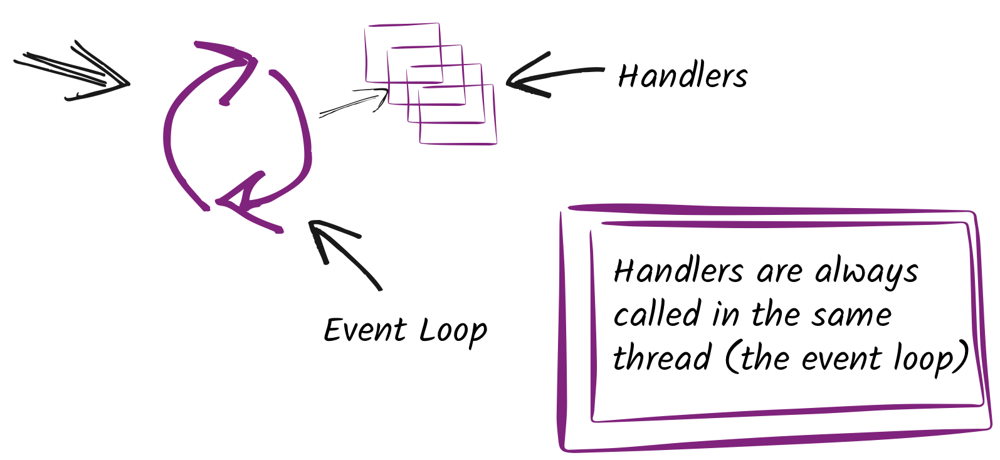
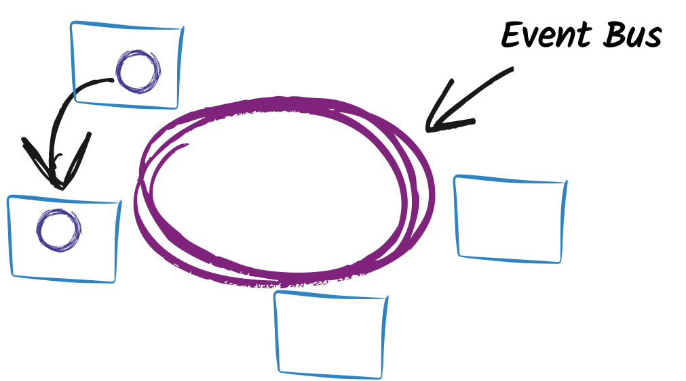

# Vert.x Web and OpenAPI

---

## About Me

Francesco Guardiani

Vert.x Mantainer & IT Engineering Student at Politecnico di Milano

Java Developer and Javascript Fan

*  @slinkyguardiani</div>
*  @slinkydeveloper</div>
*  slinkydeveloper.github.io</div>

---


* <p class="fragment grow">General Purpose</p>
* <p class="fragment grow">Polyglot</p>
* <p class="fragment grow">Fluent APIs</p>
* <p class="fragment grow">Reactive</p>
* <p class="fragment grow">All in one toolkit</p>

Note:
Eclipse Vert.x è un progetto della Eclipse Foundation. Propone queste killer feature:
- network utility, applicazione web moderna, microservice, processing di eventi, monolita con event bus
- java, javascript, groovy, ruby, ceylon, scala e il kotlin
- ne parliamo tra poco

---

## Reactive Programming

Note:
Moderno metodo di programmazione che mischia vecchi concetti di programmazione.
Reactive programming is programming with asynchronous data streams.
Esempio click del mouse -> Reactive is that idea on steroids! -> Tutto viene trattato come uno stream

---

## Reactive Programming


Note:
**Responsive** Il sistema risponde nel tempo minore possibile. è necessario per l'usabilità e incoraggiare l'interazione con l'utente maggiormente. Esempio whatsapp telegram.

**Elastic** significa che il sistema rimane responsivo sotto workload molto vari. Esempio sistema di scommesse online. Nessun bottleneck e allocamento di risorse dinamico

**Resilient** significa che il sistema rimane responsivo in caso di failure di qualsiasi tipo. le failure vengono contenute e gestite senza compromettere l'intero sistema

Le fondamenta sono i **messaggi** per permettere il loose coupling. I messaggi sono non-blocking async e consumano le risorse solo quando necessario. Message driven è diverso da event driven perchè
* il messaggio può avere vari formati: broadcast, p2p, group of subscribers
* l'handler non è attaccato all'oggetto che emette l'evento

---

## Reactive Programming

reactivemanifesto.org

---

## Why Reactive?

<p class="fragment">To solve C10K problem!</p>

Note:
Il problema C10K consiste nell'avere 10.000 connessioni contemporaneamente sullo stesso web server. Anche se interfaccia li gestisce sposto comunque il collo di bottiglia in un altro punto (esempio accesso a DB).

Multithreading non si presta a risolvere questo problema

Con Vert.x il problema C10K siamo in grado di risolverlo con le risorse di un Raspberry

---

## All in one Toolkit

* <p class="fragment">Event Bus - JSON - FS - Logging - HTTP - TCP - UDP</p>
* <p class="fragment">Web - Web Client - API Contracts</p>
* <p class="fragment">MongoDB - JDBC - SQL - Redis - Mysql - PostgreSQL</p>
* <p class="fragment">RxJava support - Kotlin Coroutines</p>
* <p class="fragment">IOT with MQTT</p>
* <p class="fragment">JWT - OAuth 2 - Shiro</p>
* <p class="fragment">SMTP - Kafka - RabbitMQ - AMQP</p>
* <p class="fragment">`vertx-awesome` for the community libs</p>

Note:
Prima cosa che mi ha detto Paulo e il motivo principale per cui ci lavoro

---

## All in one Toolkit


---

## How Vert.x works?

Note:
Vert.x ha un runtime che viene eseguito sulla JVM per permettere la programmazione reactive, che nativamente non è supportata dalla JVM.

---

### The (Multi) Reactor Pattern

Note:
Questo runtime è chiamato Reactor

---

## Event Loop and Handlers



Note:
Gli Handler sono frammenti di codice implementati da voi che eseguono azioni in risposta a determinati eventi

L'Event Loop è un thread che attende il verificarsi di un evento e una volta verificato richiama l'Handler

L'handler viene eseguito sull'event loop!

---


---

## Never stop the event loop!


Note:
La regola fondamentale è: mai bloccare l'event loop, cioè non eseguire mai codice bloccante all'interno degli handler!

---


---


Note:
Un handler, una volta gestito l'evento, può richiedere una nuova operazione asincrona che genererà un nuovo evento (richiesta a un DB)

Gli eventi come la richiesta a un DB vengono eseguiti:
* da worker thread, thread isolati che fanno il "lavoro pesante" e vengono spawnati automaticamente quando è possibile
* vengono gestiti dalle interfacce native asincrone

---


Note:
Anche se può sembrare contro intuitivo, la gestione di moltissimi eventi è efficiente con il pattern reactor.

---


Note:
La maggiore differenza tra NodeJS e Vert.x è il pattern multi reactor, cioè abbiamo diversi event loop. Questo è possibile perchè gli Handler sono indipendenti tra loro.

---

## Event Bus

Note:
Vert.x per rinforzare l'idea di Message-driven predisponde un event bus, cioè un sistema di messagistica M2M che predispone 3 tipi di comunicazione

---

#### Point 2 Point



---

#### Publish-Subscribe


---

#### Request Response (RPC)


---

#### Scaling and Connectivity


Note:
L'event bus ha dei client non solo per Vert.x stesso, ma per qualsiasi linguaggio/framework, di conseguenza posso collegare la mia applicazione Vert.x a un'applicazione Node, C++, Python, ecc...

---

## Demo time!

---

# Vert.x Web

An express/connect style web framework that helps you to create RESTful HTTP web applications

Note:
Ora passiamo a vert.x web, il modulo di vert.x che semplifica la creazione di applicazioni web, in particolare vi permette di costruire il backend della vostra applicazione web

---

## Receive your requests: Routing

<p class="fragment"></p>

Note:
Spiegare che è simile nel funzionamento ai router di internet studiati in sistemi. spiegare che con il router posso effettivamente mappare i metodi http e le path a precise operazioni (compara con dimostrazione precedente)

---

## Vert.x Web Router

```java
// Instantiate the Router
Router router = Router.router(vertx);
router.route("/hello").handler(routingContext -> {
  HttpServerResponse response = routingContext.response();
  // Get the query param (example req: /hello?name=francesco)
  String name = routingContext.queryParam("name");
  // Write to the response and end it
  response.end("Hello World " + name);
});

vertx.createHttpServer() // Create HTTP Server
    .requestHandler(router::accept).listen(8080);
```

Note:
Vertx mette a disposizione un oggetto chiamato Router.

Far notare:
- Router e metodi
- RoutingContext (contiene request, response). Serve perchè nella programmazione async/reactive dobbiamo sempre portarci dietro tutto lo stato, loose coupling

---

## Request Parameters

- Path Parameters
- Query Parameters
- JSON Body
- Form Body

Note:
Quando sviluppate una operazione volete elaborare dei parametri, esattamente come quando costruite una funzione in un qualsiasi linguaggio.

---

## 1° RoutingContext's magic

```java
router
  .route(HttpMethod.GET, "/university/:nation/:name")
  .handler(routingContext -> {
      // For example if we request:
      // "/university/italy/polimi?course=it_engineering"
      String nation = routingContext.pathParam("nation");
        // = italy
      String name = routingContext.pathParam("name");
        // = polimi
      String course = routingContext.queryParam("course");
        // = it_engineering
      // Elaborate the request!
});
```

Note:
- path parameters
- query parameters

---

## 2° RoutingContext's magic

```java
router.route().handler(BodyHandler.create());

router
  .route(HttpMethod.POST, "/user")
  .handler(routingContext -> {
      JsonObject body = routingContext.getBodyAsJson()
      // Elaborate the request!
});
```

Note:
Aggiungo BodyHandler che si occupa di parsare il body. A seconda del Content-Type parsa

---

## You can also find useful

* Authorization with JWT
* Server side rendering
* Multipart forms
* Static file serving, including caching logic and directory listing
* SockJS Support

---


Open standard for Web APIs

---

## Two major necessities

* Formally document APIs
* Automate entire APIs Development Lifecycle

Note:
Prima di OpenAPI (e dei suoi competitor) la documentazione delle API non era standardizzata ed era poco formale. Con OpenAPI documentiamo formalmente le varie operazioni delle API, permettendo quindi di utilizzare la nostra documentazione anche per altri scopi, primo tra tutti generare codice staticamente e dinamicamente

---

## What can you automate?

<p class="fragment">Everything!</p>

---

* Code scaffolding to startup your project
* Client generation
* Test generation
* Request/Response validation
* Documentation generator
* Config generation for API gateways, monitoring tools, ...

---

## OpenAPI spec

<pre class="remaining-height"><code class="lang-yaml hljs" data-trim>
openapi: "3.0.0"
info:
  title: "Super Awesome API!"
  version: "1.0.0"
paths:
  /hello_world: ...
  /users: ...
  /products: ...
components:
  schemas:
    User: /* Json schema of user */
</code></pre>

---

## Path definition

<pre class="remaining-height"><code class="lang-yaml hljs" data-trim>
/ping: /* Path name */
  post: /* HTTP Method */
    operationId: ping /* Unique operation id */
    summary: Calculate the pong from the ping provided
    parameters: ... /* Request parameters */
    requestBody: ... /* Request body description */
    responses: ... /* Responses */
</code></pre>

---

## Parameters definition

<pre class="remaining-height"><code class="lang-yaml hljs" data-trim>
parameters:
  - name: latitude
    in: query
    description: Latitude component of location.
    required: true
    schema:
      type: number
      format: double
  - name: longitude
    in: query
    description: Longitude component of location.
    required: true
    schema:
      type: number
      format: double
</code></pre>

---

## Request body definition

<pre class="remaining-height"><code class="lang-yaml hljs" data-trim>
requestBody:
  required: true
  content:
    "application/json":
      schema: /* We reefer to schema inside components */
        $ref: '#/components/schemas/Ping'
    "application/x-www-form-urlencoded":
      schema:
        $ref: '#/components/schemas/Ping'
</code></pre>

Note:
La cosa interessante è che possiamo definire in OpenAPI anche differenti metodi di serializzazione del request body

---

## Responses definition

<pre class="remaining-height"><code class="lang-yaml hljs" data-trim>
responses:
  200: /* HTTP Status code 200 */
    description: All Good, returning Pong
    content:
      application/json:
        schema:
          $ref: '#/components/schemas/Pong'
  400:
    description: Wrong Ping!
</code></pre>

---

## Vert.x ❤ OpenAPI

---

### Two tools

* `vertx-web-api-contract`
* `slush-vertx` (Unofficial)

---

## vertx-web-api-contract

Note:
vertx-web-api-contract vi da una serie di strumenti per utilizzare la vostra specifica openapi.

---

## OpenAPI3RouterFactory

Note:
OpenAPI3RouterFactory genera dinamicamente un router, definendo correttamente le path, gli handler che si occupano di validare la richiesta;

---

### Initialize the Router Factory

<pre class="remaining-height"><code class="lang-java hljs" data-trim>
OpenAPI3RouterFactory.createRouterFactoryFromFile(
  vertx,
  "src/main/resources/petstore.yaml",
  ar -> {
    if (ar.succeeded()) {
      // Spec loaded with success
      OpenAPI3RouterFactory routerFactory = ar.result();
    } else {
      // Something went wrong
      Throwable exception = ar.cause();
    }
});
</code></pre>

---

### Add handlers to your operations

<pre class="remaining-height"><code class="lang-java hljs" data-trim>
routerFactory.addHandlerByOperationId(
  "awesomeOperation",
  routingContext -> {
    RequestParameters params =
      routingContext.get("parsedParameters");
    RequestParameter body = params.body();
    JsonObject jsonBody = body.getJsonObject();
    // Do something with body
});
</code></pre>

Note:
Spiegare il RequestParameters e RequestParameter

---

### Manage a failure

<pre class="remaining-height"><code class="lang-java hljs" data-trim>
routerFactory.addFailureHandlerByOperationId(
  "awesomeOperation",
  routingContext -> {
    Throwable failure = routingContext.failure();
    if (failure instanceof ValidationException) {
      // Something went wrong during validation!
      String validationErrorMessage = failure.getMessage();
    }
    // Handle your failure
});
</code></pre>

Note:
Spiegare la ValidationException

---

### Now you are ready!

<pre class="remaining-height"><code class="lang-java hljs" data-trim>
Router router = routerFactory.getRouter();
HttpServer server = vertx.createHttpServer();
server.requestHandler(router::accept).listen();
</code></pre>

<p class="fragment"></p>

Note:
getRouter() costruisce il router

---

## `slush-vertx`

Command line tool to generate code in different languages:

* OpenAPI web server
* OpenAPI web client (with `vertx-web-client`)

---

## Demo time

---

## Thank You!